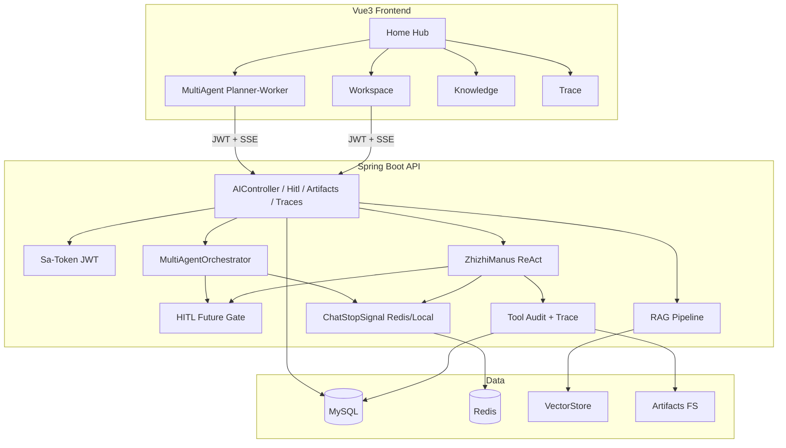

# 枝枝 AI 智能体（zhizhi-ai-agent）

基于 **Spring Boot + Spring AI + Vue 3** 的企业级 Agent 学习/求职项目。

> 目标一句话：多模型路由、ReAct 工具调用、RAG 知识库、会话持久化、可观测与安全管控的可演示 Agent 平台。

---

## 当前已有能力

### 应用

| 应用 | 说明 |
|------|------|
| **AI 面试官小助手 CC** | 多模型流式对话、查询改写、云端 RAG、会话记忆（chatId） |
| **AI 超级智能体（ZhizhiManus）** | ReAct + Tool Calling，结构化 SSE（思考 / 工具 / 回答） |

### 技术要点（已落地）

- Spring AI：ChatClient、Advisor、Tool Calling、RAG Advisor
- 多模型路由：通义千问 / DeepSeek / 豆包（方舟）
- 流式输出：SSE（Flux / SseEmitter）
- 工具集：网页搜索、爬取、文件读写、终端、资源下载、PDF 生成、任务终止
- MCP：模块 `zhizhi-image-search-mcp`（主应用侧可按需开启）
- 前端：Vue 3 + Vite，思考链展示、停止生成、Markdown 渲染

### 仓库结构

```text
zhizhi-ai-agent/
├── src/                          # Spring Boot 后端
├── zhizhi-ai-agent-frountend/    # Vue 前端
├── zhizhi-image-search-mcp/      # MCP Server 示例
├── .env.example                  # 环境变量模板（可提交）
├── .env                          # 本地密钥（勿提交）
├── scripts/run-dev.sh            # 加载 .env 后启动后端
└── README.md
```

---

## 本地启动

### 1. 配置密钥（D1 已完成）

```bash
cd zhizhi-ai-agent
cp .env.example .env
# 编辑 .env，填入真实 API Key
```

| 变量 | 用途 |
|------|------|
| `DASHSCOPE_API_KEY` | 通义千问 / DashScope |
| `DEEPSEEK_API_KEY` | DeepSeek |
| `DOUBAO_API_KEY` | 豆包（火山方舟） |
| `SEARCH_API_KEY` | SearchAPI 网页搜索 |

`application.yml` 仅保留 `${ENV}` 占位，**真实密钥只放在 `.env`**。

> 若密钥曾出现在 Git 历史中，请尽快在各云平台控制台**轮换**旧 Key。

### 2. 启动后端

```bash
# 推荐：自动 source .env
./scripts/run-dev.sh

# 或在 IDEA Run Configuration 中配置 Environment variables 后运行主类
```

默认：`http://localhost:8123/api`  
Swagger：`http://localhost:8123/api/swagger-ui.html`

### 3. 启动前端

```bash
cd zhizhi-ai-agent-frountend
cp .env.example .env   # 首次
npm install
npm run dev
```

### 4. Docker Compose（MySQL + Redis，D5）

本地可用 Docker 一键起基础设施（也可使用本机已安装的 MySQL / Redis）：

```bash
# 在项目根目录
docker compose up -d
```

| 服务 | 默认端口 | 说明 |
|------|----------|------|
| MySQL 8 | 3306 | 库名 `zhizhi_ai_agent`；首次启动自动执行 `schema.sql` |
| Redis 7 | 6379 | 默认密码 `root`（可用环境变量 `REDIS_PASSWORD` 覆盖） |

应用 `.env` 示例：

```bash
MYSQL_ENABLED=true
REDIS_ENABLED=true
REDIS_HOST=127.0.0.1
REDIS_PORT=6379
REDIS_PASSWORD=root
```

停止信号：前端点「停止」→ `POST/GET /api/zhizhi-ai/stopChatByZhizhiManus` 写入 Redis key `zhizhi:chat:stop:{chatId}` → Agent 循环在下一步前退出，不再继续 step。

---

## 全职冲刺计划（3～4 周可投简历）

面向「企业级 Agent + 求职作品」的节奏：**每天 6～8 小时有效编码**。

### 第 1 周：工程底盘

| 天 | 任务 | 验收 |
|----|------|------|
| **D1** | 密钥外置、`.env.example`、清理仓库明文 | 配置可提交且无真实 key；本地用 `.env` 能启动 |
| D2 | MySQL：`user` / `conversation` / `message` + CRUD | Postman 能建会话、落消息 |
| D3 | 前端历史侧栏 + chatId 打通面试官 & Manus | 刷新后历史可续聊 |
| D4 | JWT / Sa-Token：注册登录、接口鉴权 | 无 token 返回 401 |
| D5 | Redis 停止信号 + Agent 可取消；Docker Compose（MySQL+Redis） | 点停止后后端不再继续 step |

### 第 2 周：Agent 企业味

| 天 | 任务 | 验收 |
|----|------|------|
| D1–D2 | 知识库：上传 → 切片 → 向量库 → 检索 | 对话能带出引用片段 |
| D3 | 前端引用卡片 + 知识库上传页 | 页面可见「来自哪篇文档」 |
| D4 | 产物元数据 + 下载接口 + 右侧产物面板 | PDF/文件可下载 |
| D5 | 工具审计表（谁/何时/tool/入参摘要/结果） | 库中有审计记录 |

### 第 3 周：工作台 + 加分深度

| 天 | 任务 | 验收 |
|----|------|------|
| D1–D2 | Workspace 三栏：历史 \| 对话+思考 \| 计划/产物 | 可截图上简历 |
| D3 | 危险工具 HITL（终端/写文件二次确认） | 演示拒绝与允许 |
| D4 | MCP 打通（如 image-search） | 简历可写 MCP |
| D5 | TraceId + Token/耗时落库 + 极简统计页 | 能回答单次任务消耗 |

### 第 4 周：包装投递

| 天 | 任务 |
|----|------|
| D1 | README 架构图、启动步骤、3 个演示场景 |
| D2 | 录 3～5 分钟 Demo；准备 1 页架构讲解 |
| D3 | Planner → Worker 多 Agent 最小链路 |
| D4 | 稳定性（停止/超时/错误提示）+ 核心单测 |
| D5 | 简历条目打磨 + 模拟面试自问自答 |

**3 周极速版（可砍）**：去掉 HITL 弹窗、MCP、Trace 页、多 Agent；保留登录、会话历史、可取消、知识库引用、产物下载、Docker、README/视频。

---

## Agent 功能规划（企业级）

### 必做（称得上企业级）

| 功能 | 说明 | 状态 |
|------|------|------|
| 用户认证 + 数据隔离 | Sa-Token JWT，按用户隔离会话 | **D4 完成** |
| 会话 / 消息持久化 | MySQL + MyBatis-Plus CRUD；连库开关预留 | **D2 完成（待本地 MySQL）** |
| 知识库可管理 | 上传、切片、VectorStore 检索、对话引用卡片 | **W2 D1–D3 完成** |
| 工具治理 | 审计日志；危险工具审批 | 审计 **W2**；HITL **W3 D3 完成** |
| 真正取消任务 | 前端 abort + Redis 停止信号 + Agent 不再继续 step | **D5 完成** |
| 产物可交付 | PDF/文件入库并可下载 | **W2 D4 完成** |
| 可观测 | TraceId、Token、耗时 | **W3 D5 完成** |
| 密钥与配置外置 | 环境变量 / `.env` | **已完成（D1）** |

### 加分（做 2～3 个即可）

| 功能 | 说明 |
|------|------|
| Human-in-the-loop | 终端 / 写文件执行前二次确认 |
| MCP 插件接入 | 独立 MCP Server + Client |
| 异步任务中心 | 长任务可离开页面再回看 |
| 多 Agent 协作 | Planner + Worker 一条可演示链路 |
| 评测集 | 约 20 条用例做质量回归 |

### 暂不做（投入大、简历增益低）

- 完整可视化 Workflow 编排器（Dify 级）
- 计费 / 复杂运营后台
- 自研浏览器 Computer Use
- 完整 Agent 插件市场

### 目标技术栈（规划补齐）

```text
Java + Spring Boot + Spring AI
Vue 3 + Vite
MySQL + MyBatis-Plus + Redis
向量库（pgvector / Milvus / DashVector 择一）
对象存储（MinIO / OSS，产物与文档）
JWT / Sa-Token
Docker Compose
MCP（工具扩展）
结构化日志 / Trace（Micrometer 或自建表）
```

### 当前已落地架构



### 前端路由（已落地）

```text
/                 Agent Hub 首页
/workspace        三栏工作台（历史 | 对话+思考 | 计划/产物）
/multi-agent      Planner → Worker 多 Agent 演示
/super-agent      超级智能体（单栏）
/love-master      AI 面试官小助手 CC
/knowledge        知识库管理
/trace            Trace / Token 统计
/login            登录注册
```

### 演示场景（3 个）

#### 场景 1：Workspace + HITL

| 项 | 内容 |
|----|------|
| 入口 | 登录后打开 `/workspace` |
| Prompt | `帮忙写一个 hello.txt，内容为「早上好，枝枝」，只写 txt` |
| 预期 | 弹出「危险工具待确认」；点**拒绝** → 计划显示「写入文件 已拒绝」；点**允许** → 产物可下载 |

#### 场景 2：知识库 RAG

| 项 | 内容 |
|----|------|
| 入口 | `/knowledge` 上传文档 → `/love-master` 提问 |
| Prompt | 针对上传文档内容提问（如「文档里提到的技术栈有哪些？」） |
| 预期 | 回答下方出现引用卡片（来自哪篇文档） |

#### 场景 3：产物 + Trace

| 项 | 内容 |
|----|------|
| 入口 | `/workspace` 生成 PDF 后打开 `/trace` |
| Prompt | `请生成一份简短的 hello.pdf，介绍枝枝 AI 智能体`（HITL 若弹出请**允许**） |
| 预期 | 右侧「产物」可下载；`/trace` 可见 TraceId、Token、耗时 |

更多口播与架构讲解见 [`docs/`](docs/)（[`demo-script.md`](docs/demo-script.md)、[`architecture.md`](docs/architecture.md)、[`resume-bullets.md`](docs/resume-bullets.md)、[`interview-qa.md`](docs/interview-qa.md)）。

---

---

## D2：会话持久化 API（需启用 MySQL）

未部署 MySQL 前保持 `MYSQL_ENABLED=false`，应用可正常启动，相关接口不会注册。

### 启用步骤（本地 MySQL 就绪后）

```bash
# 1. 建库
mysql -uroot -p -e "CREATE DATABASE IF NOT EXISTS zhizhi_ai_agent DEFAULT CHARACTER SET utf8mb4;"

# 2. 执行建表（MyBatis 不会自动建表）
mysql -uroot -p zhizhi_ai_agent < src/main/resources/db/schema.sql

# 3. .env 填写并打开开关
MYSQL_ENABLED=true
MYSQL_USERNAME=root
MYSQL_PASSWORD=你的密码
```

### 表结构

| 表 | 说明 |
|----|------|
| `app_user` | 用户（D4 鉴权前可先建测试用户） |
| `conversation` | 会话，`chat_id` 对齐前端 |
| `message` | 消息（user/assistant/system/tool） |

### 接口（context-path=`/api`）

| 方法 | 路径 | 说明 |
|------|------|------|
| POST | `/users` | 创建用户 |
| GET | `/users/{id}` | 查询用户 |
| POST | `/conversations` | 创建会话 |
| GET | `/conversations?userId=` | 会话列表 |
| GET | `/conversations/{chatId}` | 会话详情 |
| PUT | `/conversations/{chatId}` | 更新标题/状态 |
| DELETE | `/conversations/{chatId}` | 删除会话及消息 |
| POST | `/conversations/{chatId}/messages` | 追加消息 |
| GET | `/conversations/{chatId}/messages` | 消息列表 |

Swagger：启用 MySQL 后打开 `/api/swagger-ui.html` 可见「用户」「会话与消息」分组。


---

## D4：认证（Sa-Token JWT）

启用 `MYSQL_ENABLED=true` 后生效。

| 方法 | 路径 | 说明 |
|------|------|------|
| POST | `/auth/register` | 注册并返回 token |
| POST | `/auth/login` | 登录返回 token |
| POST | `/auth/logout` | 退出 |
| GET | `/auth/me` | 当前用户 |

请求头：`Authorization: Bearer <token>`

白名单：`/auth/login`、`/auth/register`、`/health`、Swagger。其余接口需登录。

前端：`/login` 页；访问面试官 / 超级智能体需先登录。


---

## D5：Redis 停止信号 + Agent 可取消

启用 `REDIS_ENABLED=true` 后，停止标记写入 Redis（多实例共享）；未启用时使用进程内 Map 兜底。

| 能力 | 说明 |
|------|------|
| 停止接口 | `GET /zhizhi-ai/stopChatByZhizhiManus?chatId=...&type=COMMON\|PROFESSIONAL` |
| Redis Key | `zhizhi:chat:stop:{chatId}`，TTL 600s |
| Manus | `BaseAgent` 每步 / think↔act 之间轮询信号，命中则 `CANCELLED`，不再继续 step |
| 面试官 | SSE `takeWhile` 检查同一停止信号，截断后续推送 |

验收：超级智能体多步任务中点「停止」，后端日志出现 cancelled，后续 step 不再执行。


---

## W2 D1–D2：知识库（上传 → 切片 → VectorStore → 检索）

向量库当前使用 Spring AI **`SimpleVectorStore`**（本地 JSON 持久化，文件见 `data/vector-store/`）。文档元数据存 MySQL 表 `kb_document`。

切片策略（`KNOWLEDGE_SPLIT_STRATEGY` / `app.knowledge.split-strategy`）：

| 值 | 说明 |
|----|------|
| `paragraph`（默认） | 按空行分段；过短合并；单段过长再回退 Token 切 |
| `token` | 纯 `TokenTextSplitter` 按 token 窗口切 |

启用前执行：

```bash
mysql -uroot -p zhizhi_ai_agent < src/main/resources/db/tables/04_kb_document.sql
# 或重新执行完整 schema.sql
```

| 方法 | 路径 | 说明 |
|------|------|------|
| POST | `/knowledge/documents` | multipart 上传 `.md` / `.txt` / `.docx` / `.doc`，自动切片写入 VectorStore |
| GET | `/knowledge/documents` | 当前用户文档列表 |
| GET | `/knowledge/documents/{id}` | 详情 |
| DELETE | `/knowledge/documents/{id}` | 删除元数据 + VectorStore 切片 |
| POST | `/knowledge/retrieve` | `{ "query": "...", "topK": 4 }` 返回引用片段 |

面试官流式对话会：检索本地 VectorStore → 拼入提示词 → SSE 先推 `__CITATIONS__[...]`；前端解析为引用卡片（展示来自哪篇文档）。

前端：`/knowledge` 知识库管理页（需登录）；首页入口「知识库」。

## W2 D4–D5：产物元数据 + 工具审计

超级智能体（ZhizhiManus）在 `ToolCallAgent.act()` 执行工具后：

1. **工具审计**：写入 `tool_audit_log`（userId / chatId / toolName / 入参摘要 / 结果摘要 / success / durationMs）
2. **产物入库**：若工具为 `generatePDF` / `writeFile` / `downloadResource` 且结果含本地路径，则拷贝到 `data/artifacts/` 并写入 `artifact` 表

启用前执行：

```bash
mysql -uroot -p zhizhi_ai_agent < src/main/resources/db/tables/05_artifact.sql
mysql -uroot -p zhizhi_ai_agent < src/main/resources/db/tables/06_tool_audit_log.sql
# 或重新执行完整 schema.sql
```

| 方法 | 路径 | 说明 |
|------|------|------|
| GET | `/artifacts?chatId=` | 当前用户产物列表（可按会话筛） |
| GET | `/artifacts/{id}/download` | 鉴权下载（`Content-Disposition: attachment`） |
| GET | `/tool-audits?chatId=&limit=` | 工具调用审计列表 |

前端：超级智能体右侧「产物」面板（宽屏常驻，窄屏点顶栏「产物」）；`tool_done` 后自动刷新。

## W3：Workspace + HITL + MCP + Trace

### Workspace（D1–D2）

路由 `/workspace`：三栏 **历史 | 对话+思考 | 计划/产物**（右侧 Tab 切换）。首页入口「Agent Workspace」。

### HITL 危险工具审批（D3）

对 `executeTerminalCommand` / `writeFile`：执行前 SSE 推送 `hitl_required`，前端弹窗；调用：

| 方法 | 路径 | 说明 |
|------|------|------|
| POST | `/hitl/{approvalId}/approve` | 允许执行 |
| POST | `/hitl/{approvalId}/reject` | 拒绝执行 |

超时默认 120s（`HITL_TIMEOUT_SECONDS`）。

### MCP 图片搜索（D4）

- 模块：`zhizhi-image-search-mcp`（可独立 SSE/stdio 启动）
- 主应用：`MCP_ENABLED=true` 时合并 MCP 工具到 Manus；未开启时可用本地 `ImageSearchTool`（需 `PEXELS_API_KEY`）

```bash
# 可选：打包并启用 MCP Client
cd zhizhi-image-search-mcp && ../mvnw -q -DskipTests package
# .env: MCP_ENABLED=true
```

### Trace（D5）

表 `agent_trace`；每次 Manus 任务生成 TraceId，累计 Token/耗时/步数。

```bash
mysql -uroot -p zhizhi_ai_agent < src/main/resources/db/tables/07_agent_trace.sql
```

| 方法 | 路径 | 说明 |
|------|------|------|
| GET | `/traces` | 最近任务列表 |
| GET | `/traces/{traceId}` | 详情 |
| GET | `/traces/stats/summary` | 极简统计 |

前端：`/trace` 统计页。


## 进度追踪

| 里程碑 | 状态 |
|--------|------|
| D1 密钥与配置工程化 | ✅ 完成 |
| D2 用户/会话/消息表 + CRUD（MyBatis-Plus，MySQL 连接预留） | ✅ 完成 |
| D3 前端历史侧栏 + chatId 打通面试官 & Manus | ✅ 完成 |
| D4 Sa-Token JWT 注册登录与接口鉴权 | ✅ 完成 |
| D5 Redis 停止信号 + Agent 可取消 + Docker Compose | ✅ 完成 |
| W1 工程底盘 | ✅ 完成 |
| W2 D1–D3 知识库（后端链路 + 前端页 + 引用卡片） | ✅ 完成 |
| W2 D4–D5 产物 + 工具审计 | ✅ 完成 |
| W3 Workspace + HITL + MCP + Trace | ✅ 完成 |
| W4 Demo / 简历包装 | ✅ 完成（见 [`docs/`](docs/)；录屏请按 [`docs/demo-script.md`](docs/demo-script.md) 本地录制） |

---

## 许可证

仅供学习与求职作品展示使用。
